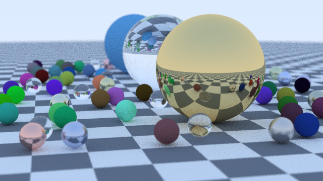

# Examples

Run any of these with `azula run FILE` (or build them with `azula build FILE`).
Every example is built with both the Rust compiler and the self-hosted compiler
by `tests/run_examples.sh`, which checks that they print the same thing (the web
server is started, sent some requests with curl and stopped).

| Example | Shows |
| --- | --- |
| [hello.azl](hello.azl) | The smallest program |
| [fib.azl](fib.azl), [factorial.azl](factorial.azl), [fizzbuzz.azl](fizzbuzz.azl) | Functions, recursion and conditionals |
| [structs.azl](structs.azl) | Structs, methods, `&self` vs `self`, nested fields and `alloc` |
| [enums.azl](enums.azl) | Plain enums, enums with payloads, and `match` on enums and characters |
| [generics.azl](generics.azl) | Generic functions, structs and enums, `Option`, inference and turbofish |
| [sorting.azl](sorting.azl) | A generic quicksort over `Vec<T>` |
| [word_count.azl](word_count.azl) | `Map`, `Vec` and `StringBuilder` together |
| [sieve.azl](sieve.azl) | Constants and a raw heap array (`malloc`, `sizeof`, pointer indexing) |
| [game_of_life.azl](game_of_life.azl) | Conway's Game of Life on a wrapping grid |
| [calculator.azl](calculator.azl) | A tokenizer, recursive-descent parser and evaluator; reads its expression from the command line |
| [brainfuck.azl](brainfuck.azl) | An interpreter for Brainfuck |
| [modules/main.azl](modules/main.azl) | Splitting a program into modules with `import ... as` and `pub` |
| [raytracer/main.azl](raytracer/main.azl) | A ray tracer: glass, metal and matte spheres with reflections, refraction, soft shadows and depth of field, saved by a PNG encoder written from scratch (CRC-32, Adler-32, zlib). `azula build --release raytracer/main.azl -o rt && ./rt 640 48` renders the picture below |
| [http_server/main.azl](http_server/main.azl) | A small web server using `std/net.azl`: routing, headers, POST bodies and a visit counter (`azula run http_server/main.azl [PORT]`) |

*Rendered by [raytracer/main.azl](raytracer/main.azl) (640x360, 48 samples per pixel, 30 seconds).*

For a much bigger example, the compiler itself is written in Azula: see [`compiler/`](../compiler).
